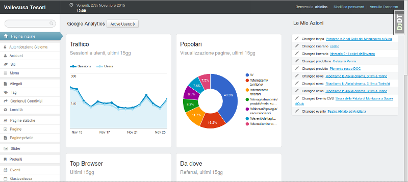

# django-otto-admin

Django admin customization app for [django-suit](https://github.com/darklow/django-suit)

Would you like to have some google analytics report widgets in your admin index page? Then you're in the right place!



## Features

- locales: en, it
- custom copyright string
- custom developed by string and url
- custom support mailto
- admin index with google analytics panel implemented through [analytics embed API](https://ga-dev-tools.appspot.com/)
    - Realtime active users
    - Traffic (sessions and users), last 15 days
    - Popular Page views, last 15 days
    - Top Browsers, last 15 days
    - Referral traffic, last 15 days
    - Visitors Countries, last 15 days
    - Social actions, last 15 days

### Configure your analytics widgets

Follow the steps in the Google Identity Platform documentation to [create a service account](https://developers.google.com/identity/protocols/OAuth2ServiceAccount#creatinganaccount) from the [Google Developer Console](https://console.developers.google.com/).

Once the service account is created, you can click the Generate New JSON Key button to create and download the key and add it to your project.

Add the service account as a user in Google Analytics. The service account you created in the previous step has an email address that you can add to any of the Google Analytics views you'd like to request data from. It's generally best to only grant the service account read-only access.

Then you will need to configure __otto\_admin__ with the json path and the view ID (continue reading).

## Requirements

- django-suit
- google-api-python-client

## Getting Started

1. Install django-otto-admin
    ```
    pip install django-otto-admin
    ```

2. Configure your django-suit installation
3. Add `otto_admin` to your installed apps __before__ `suit`
    ```
    INSTALLED_APPS = (
        'otto_admin',
        'suit',
        'django.contrib.admin',
        # ...
    ```
4. Configure your settings

## Settings configuration

###__OA_ANALYTICS_CREDENTIALS_JSON (required)__
full path to the json key file of your app service account

###__OA_ANALYTICS_VIEW_ID (required)__
id of the analytics view you want to show in the admin index

###__OA_COPYRIGHT__
Copyright string, default '2015 Otto srl'

###__OA_SUPPORT_EMAIL__
Mailto support email, default 'mail@otto.to.it'

###__OA_POWERED_BY__
Powered by string, default 'Otto srl'

###__OA_POWERED_BY_URL__
Powered by url, default 'http://www.otto.to.it'
